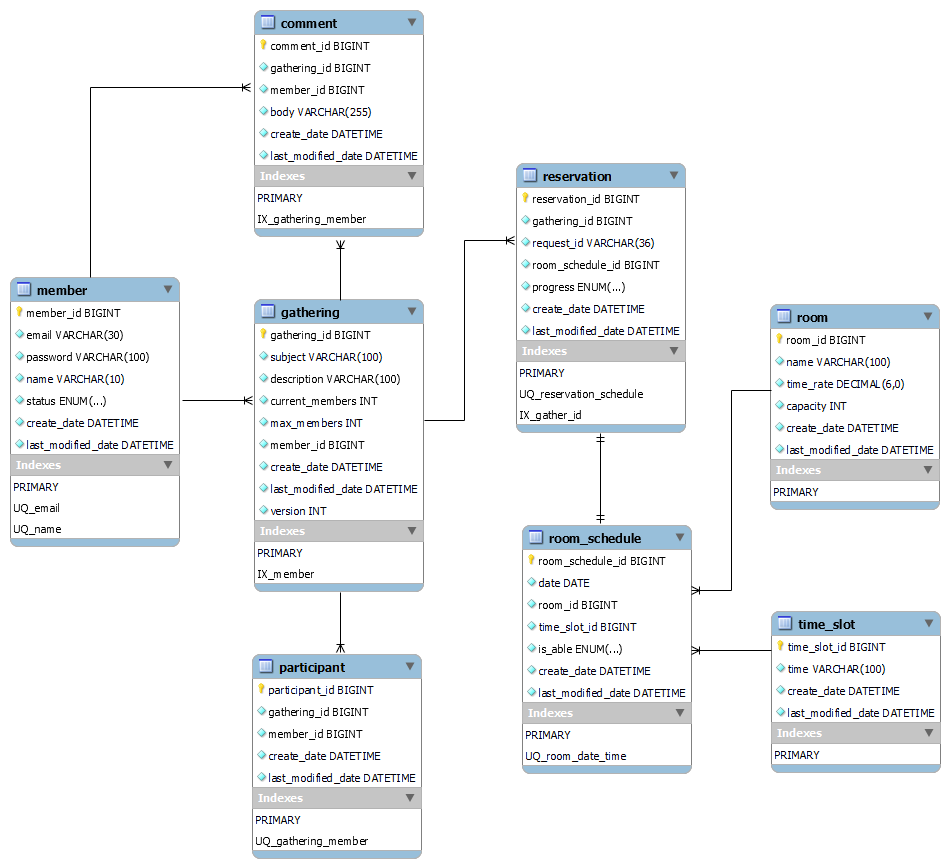

# ❓What's Gathering
Gathering은 소규모 모임 예약 서비스입니다.

대규모가 아닌 소규모 모임에 특화된 Gathering은 간한 기능으로 모임을 개설 및 관리할 수 있는 서비스 입니다.

본 프로젝트의 취지는 실무에서 경험하지 못 했던 기술과 개념을 이해하고 체득하기 위함 입니다.

# 👁️‍🗨️프로젝트 기능 살펴보기
- 회원 기능
  - 회원가입
  - 로그인(Session을 통한 인증. JWT와 같은 토큰을 이용한 인증방식은 아직 생각 중이지 않음)
  - 정보 조회
- 모임 기능
  - 모임 개설
  - 모임 참가
  - 모임 댓글작성
  - 모임 정보 조회
- 예약 기능
  - 예약 가능한 장소 및 시간 조회
  - 예약
  - 예약 취소

# 🎯목표
- 실무에선 경험해보지 못한 기술이나 개념을 사용해보려고 노력.
  - record 클래스, ORM, CQRS, 캐싱, 유닛 테스트를 적용
- 낙관적 락과 비관적 락을 이용한 동시성 이슈 해결
  - JPA의 version 관리를 이용한 낙관적 락 + Retry를 사용하여 동시성 관리 적용.
  - 베타 락을 사용하여 동시성 관리 적용.
    - [낙관적 락과 비관적 락으로 동시성 제어(with. Retry)](https://velog.io/@no-int/%EB%82%99%EA%B4%80%EC%A0%81-%EB%9D%BD%EA%B3%BC-%EB%B9%84%EA%B4%80%EC%A0%81-%EB%9D%BD%EC%9C%BC%EB%A1%9C-%EB%8F%99%EC%8B%9C%EC%84%B1-%EC%A0%9C%EC%96%B4with.-Retry)
- OOP를 최대한 준수한 코드로 유지보수에 유리한 코드 사용 및 CQRS 사용한 기능 책임분리.
  - 중복된 코드를 줄이고, 확장이 용이한 코드를 사용하도록 노력.
    - [DTO객체는 Record 클래스로!](https://velog.io/@no-int/DTO%EA%B0%9D%EC%B2%B4%EB%8A%94-Record-%ED%81%B4%EB%9E%98%EC%8A%A4%EB%A1%9C)
  - 서비스 기능이 늘어 감에 따라 도메인 분리만으로는 코드의 명확성이 떨어진다고 판단해 객체 수준에서 쿼리와 커멘드를 분리하여 관리하는 CQRS 적용.
    - [CQRS 적용하여 비즈니스 로직 분리](https://velog.io/@no-int/CQRS-%EC%A0%81%EC%9A%A9%ED%95%98%EC%97%AC-%EB%B9%84%EC%A6%88%EB%8B%88%EC%8A%A4-%EB%A1%9C%EC%A7%81-%EB%B6%84%EB%A6%AC)
- 유닛 테스트.
  - 유닛 테스트로 기능을 검증하여 코드의 안정선 확보.
- 캐싱 적용 및 성능 검증
  - 변경이 적고 자주 조회되는 API에 캐싱을 적용 후 JMeter를 사용하여 적용 전후의 성능 차이를 분석.
    - [조회 성능 개선하기 Redis 캐싱 적용기](https://velog.io/@no-int/%EC%A1%B0%ED%9A%8C-%EC%84%B1%EB%8A%A5-%EA%B0%9C%EC%84%A0%ED%95%98%EA%B8%B0-Redis-%EC%BA%90%EC%8B%B1-%EC%A0%81%EC%9A%A9%EA%B8%B0)
    - [JMeter로 캐싱 적용 전후의 성능차이 분석](https://velog.io/@no-int/JMeter%EB%A1%9C-%EC%BA%90%EC%8B%B1-%EC%A0%81%EC%9A%A9-%EC%A0%84%ED%9B%84%EC%9D%98-%EC%84%B1%EB%8A%A5%EC%B0%A8%EC%9D%B4-%EB%B6%84%EC%84%9D)

# 🛠️사용 기술
 - Java 21
 - Spring boot 3.2
 - MySQL8.0 / Redis / H2(test)
 - JPA(Hibernate6) + QueryDSL
 - JUnit5
 - JMeter

# 🪢ER 다이어그램

